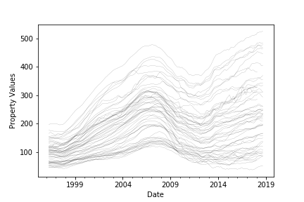
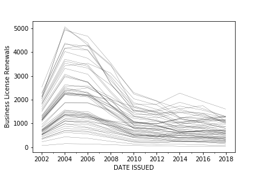
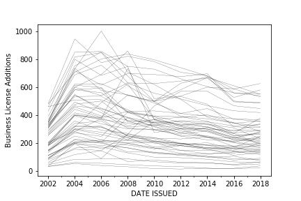
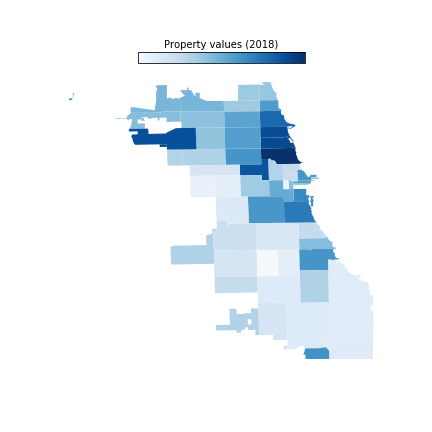
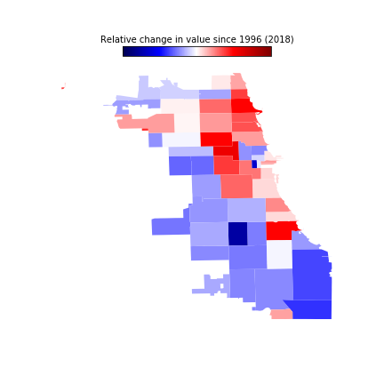
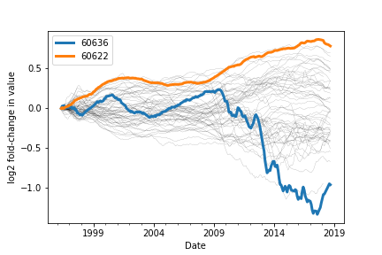

# Using Business License Records to Predict Property Values

## Project Summary

I propose to build a predictive model relating the many complex features of Chicago neighborhood business activities to their respective change in property values. While my data are limited to Chicago, any insights and methods derived from my project should be applicable to other cities.

## Project Motivation

Real estate companies like Zillow and Trulia use an assortment of general economic and market indicators to forecast property values for entire cities. However, property values within a city show substantial heterogeneity despite similar construction costs, mortgage interest rates, and property tax rates. Property values might also be intricately coupled to the character and success of local businesses. For instance, a neighborhood substituting liquor stores with fashion boutiques is likely on the rise, while one with high turnover could be headed for stagnation. I propose to investigate whether municipal business licensing data can be used to predict real estate trends within a city. Beyond informing real estate investments, the proposed model could help city governments monitor the economic health of their constituent communities and encourage applications for specific types of licenses to facilitate economic growth.

All major cities require businesses to maintain an active license to operate. A license is required every time a home is listed on Airbnb, a bar is shut down, or a restaurant moves to a new location. Licenses are acquired before a business opens, must be renewed regularly, are cancelled when a business closes, and may be revoked by the city. As the issuance, renewal, cancellation, and revocation of these licenses are part of the public record, they provide a potentially potent sensor for economic activity at city-block resolution.

## Project Data

The City of Chicago digitally publishes all business license data from 2002 onward. These data amount to roughly one million license records (~300 MB) that include the type of license, business name, license status, and business address. The ten most frequently issued types of licenses are tabulated below.

Property value indicators for all Chicago zip codes throughout this time period are readily available via the Zillow API. The market shows a city-wide positive trend across the past two decades, interrupted by the 2008 financial crisis.

## Objective

For my project, I plan to build a predictive model relating the many complex features of Chicago neighborhood business activities to their respective change in property values. The data are limited to Chicago, but any insights and methods derived from my project will be applicable to other cities. Furthermore, the approach could be extended to a finer geographic scale should property value data become available at sub-zip code resolution.

## Preliminary Analysis

#### Business License Trends

As an initial effort, I obtained and pre-processed the license and real estate data, then surveyed their dynamic trends. Some anomalies unique to Chicago caught my attention. Most notably, the city government consolidated its licensing categories in 2012 leading to an abnormally high rate of apparent license turnover in 2011/2012. I excluded those two years from the data, then imputed their values from 2013. I then compiled license renewal, addition, and turnover timeseries for each zip code in Chicago. The magnitudes of these quantities depend upon the size and population density of each zip code, so I normalized the rates of license addition (newly issued) and turnover (cancelled/revoked) by the annual renewal rate. The timeseries data are quite noisy so I applied some smoothing where necessary. The data reflect a substantial city-wide decrease in the rate of license renewals that coincides with the 2008 recession.

However, new licenses seem to be introduced at a fairly constant overall rate.

#### Property Value Trends

The real estate data reflect a known reality: Chicago's North side has higher property values than its South side.

To account for this, I normalized each property value timeseries by the earliest available property value of the corresponding zip code, then applied a log transform. The resultant timeseries therefore reflect return on investment relative to the first year in the data. Indeed, property values on the North side have dramatically outperformed the South side relative to the market average over the past two decades.

I performed a linear detrending to remove the effect of market-wide fluctuations such as the drop and recovery following the 2008 recession. Finally, I numerically differentiated the detrended normalized timeseries, yielding the rate of change in relative value for each zip code at each point in time. I mapped these rates of change to a map of the city and animated their evolution over time, providing a __[spatiotemporal depiction](https://github.com/sebastianbernasek/dataincubator/tree/master/videos)__ of investment hot spots over the past two decades.

To my surprise, my former zip code of 60622 showed the strongest performance to date.

It is not a historically wealthy zip code, nor does it rival the density of restaurants, bars, and shops found downtown. However, it is a poster child for the wave of gentrification that recently swept Chicago's west side. The licensing data reflect this notion - as 60622 has one of the highest rates of business license addition in the entire dataset, with a sharp increase in the net rate of licensing coinciding with the 2009 start of its recent increase in property values. These early insights appear to confirm that the housing market parallels complex changes in economic activity. The same is evident at the macroscopic level, as the net rate of licensing and property value timeseries are weakly correlated (R=0.4).

## Next Steps

This elementary analysis reveals an underlying trend that prompts further exploration. For my project I propose to expand these efforts by building a model that leverages the wealth of microscopic information in the licensing data. I plan to combine the rates of addition, renewal, and turnover for each type of licenses with the licensing history of each neighborhood in a network-based model that captures the spatiotemporal landscape of Chicago's small business economy. By projecting licensing data from each zip code onto a weighted graph connecting adjacent zip codes, a network-based model will allow for businesses influencing the perceived value of adjacent zip codes. I plan to train this model formulation on a subset of the available data then validate the model by predicting the property value trends in the remaining data. My goal for the project is to achieve a prediction accuracy comparable to Zillow (<5% error) while identifying the features that reflect up and coming neighborhoods.

## Repository Contents

The repository is organized into several subdirectories:

  - **notebooks**: jupyter notebooks used to conduct the preliminary analysis

  - **modules**: python modules used to conduct the preliminary analysis

  - **figures**: rendered figures

  - **videos**: animated figures

  - **tables**: rendered tables
